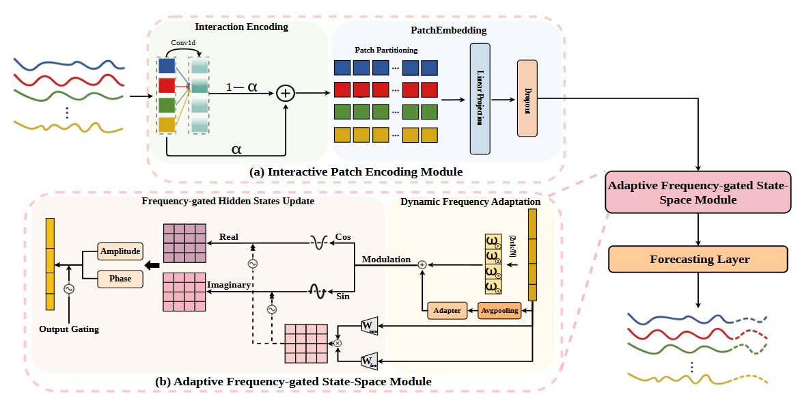
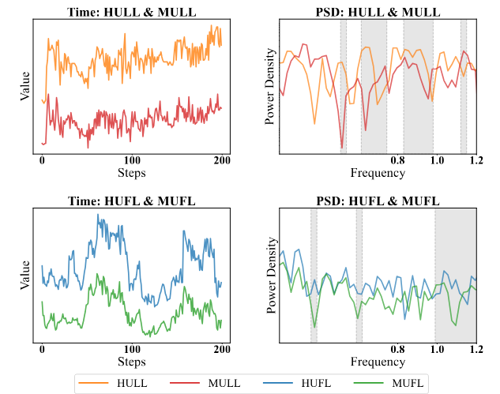

<h1 align="center">
AdaMamba: Adaptive Frequency-Gated Mamba for Long-Term Time Series Forecasting
</h1>

<div align="center">
  Xudong Jiang<sup>1</sup>, Mingshan LOO<sup>1</sup>, Hanchen Yang<sup>1,2</sup>, Wengen Li<sup>1</sup>, Mingrui Zhang<sup>1</sup>, Yichao Zhang<sup>1</sup>, Jihong Guan<sup>1</sup>, Shuigeng Zhou<sup>3</sup><br>
  <sup>1</sup>Tongji University, Shanghai, China &emsp; 
  <sup>2</sup> Hong Kong Polytechnic University, Hong Kong, China<br>
  <sup>3</sup>Fudan University, Shanghai, China<br>
</div>

<br>

<div align="center">
  
</div>

<div align="center">
    <a href="https://arxiv.org/abs/24xx.xxxxx"></a> &ensp;
    <a href="https://github.com/XDjiang25/AdaMamba"></a> &ensp;
    
</div>

<br>

This is the official repository for **AdaMamba**, a novel framework that endogenizes adaptive and context-aware frequency analysis within the Mamba state-space update process.

---

## :bulb: Motivation

<div align="center">
  
  <p align="justify" style="width: 80%; margin-top: 10px;">
    <strong>Figure 1:</strong> A motivating example of the ETTm1 dataset in both time and frequency domains. While "HULL" & "MULL", as well as "HUFL" & "MUFL", exhibit noticeable similarities in the time-domain, their frequency characteristics differ markedly, particularly in the gray-highlighted regions. (Left) Time domain: time-series variations over 200 time steps. (Right) Frequency domain: frequency discrepancies visualized via Power Spectral Density (PSD).
  </p>
</div>

---

## :tada:Usage
### :wrench:Setup

The required dependencies for this project are listed in `requirements.txt`. You can install them using pip with the following command:

```bash
pip install -r requirements.txt
```

(*Optional*) If you still encounter the package missing problem, you can refer to the [`requirements.txt`](./requirements.txt) file to download the packages you need. 

**If you encounter other environment setting problems not mentioned in this README file, please contact us to report your problems or open an issue.**

### :fire:Quick Start
You can use the following instruction in the root path of this repository to run the training process:
```bash
bash scripts/AdaMamba_ETTm1.sh
```


##  Citation

If you find this repo helpful, please cite our paper. 

```
